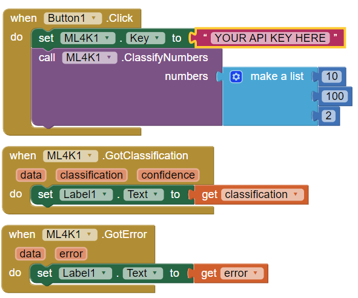

# ML4K AppInventor Extension
Use machine learning in AppInventor, with easy training using text, images, or numbers through the [Machine Learning for Kids](https://machinelearningforkids.co.uk/) website.

## Example

### Text classification

### Image classification

Note: The ClassifyImage block takes the path to an image, which you can get from the Selected property of an ImagePicker.

### Numbers classification

### Live examples
See example .aia projects in the examples directory of this repo (Created by [Joe Mazzone](https://github.com/MrMazzone)). Look at the code blocks for where to add your API key (API key is not included), they are set in the click method - though you can set it anywhere you choose as long as it is before the classification occurs.

## Installation
Download the latest extension file (.aix) from the [releases](https://github.com/kylecorry31/ML4K-AI-Extension/releases) page and follow section "2. How to use extensions components" of [this website](http://ai2.appinventor.mit.edu/reference/other/extensions.html) to add the extension to your App Inventor project.

## Guide
1. After installing the extension, you need to get an API key, which can be obtained from [Machine Learning for Kids](https://machinelearningforkids.co.uk/).

2. Copy and paste the API Key into the ML4K component’s “Key” property on the Designer screen or use the "set Key" block on the Blocks screen. Note: API Key must be set before you can use any of the ML4K extension blocks for classification. If you choose to set the key using the “set Key” block, be sure to set the key in the Screen.Initialize event or any time before you use a classification method (purple block).

3. Classify the text, image, or numbers.
  * If classifying text, use the "ClassifyText" block with the text to classify.
  * If classifying images, use the "ClassifyImage" block with the image path to classify.
  * If classifying numbers, use the "ClassifyNumbers" block with a list of numbers to classify.

4. Use the "GotClassification" block to retrieve the classification once it is completed.

5. Use the "GotError" block to retrieve any errors which occur during classification.

### Handling Errors
Upon an error, the "GotError" block will be called with the error that occurred.

## License
This project is licensed under the [MIT License](LICENSE).

## Credits
* [The Machine Learning for Kids](https://github.com/IBM/taxinomitis) for providing the training tool and API endpoint.
* [Kyle Corry (Me)](https://github.com/kylecorry31) for project planning, programming the extension, and testing.
* [Joe Mazzone](https://github.com/MrMazzone) for project planning, testing, and examples.

## Contribute
Please feel free to contribute to this extension, or if you find an issue be sure to report it under issues.
